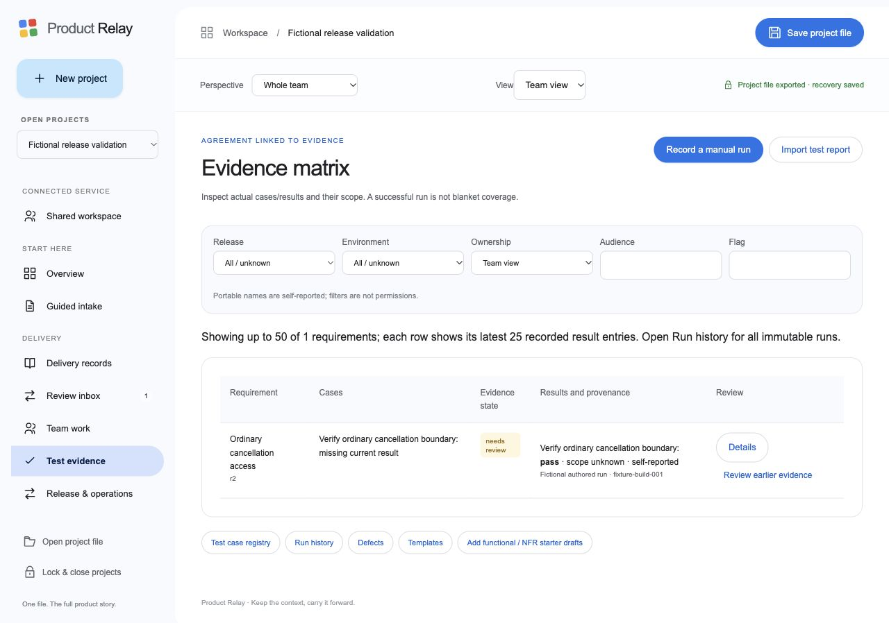

# Product Relay validation — 5 October 2026

**The tested local checks pass after five product bug fixes. Full Phase 2 acceptance and production operation are not confirmed.** This report records actual execution, test doubles, findings and remaining evidence. It replaces the earlier “testing deferred” status; it does not change the original V01–V18 acceptance contracts.

| Check | Actual result | Evidence |
| --- | --- | --- |
| Full Node suite and syntax checks | **223/223 passed**, 0 failures/skips | [Final output](automated-final.txt) |
| Browser storage | **17/17 passed** using actual Web Crypto/IndexedDB and separate client instances | [Results](storage-browser-final.txt) |
| Browser documents/media preprocessing | **8/8 passed** using actual PDF.js/Mammoth workers, canvas PDF rasterization and AudioContext WAV decoding | [Results](document-browser-final.txt) |
| Lexical retrieval regression | **15/15 assertions passed**, initially 14/15 | [Final](retrieval-final.json), [initial failure](retrieval-initial.json) |
| Authored browser project | Requirement/case approval, manual result, recovery reload/unlock and local question retrieval exercised | [Evidence matrix](authored-evidence.txt), [question](authored-query.txt) |
| Section navigation | 22 captured section visits rendered; navigation smoke only | [DOM observations](navigation.json) |
| Layout and focused keyboard check | 390 × 844 page has no horizontal page overflow; visible controls have labels; Escape returns focus to the manual-run opener | [Mobile](mobile-evidence.txt), [focus](keyboard-focus.json), [scope layout](scope-layout-mobile-final.json) |
| Retained older encrypted sample | Schema 4 / vault 1 sample opens with six sources/two baselines; new sharing round reopens | [Result](retained-legacy-sample.json) |
| Performance | Five trials at each of four requirement tiers; see figures below | [100](performance-100.json), [1,000](performance-1000.json), [3,000](performance-3000.json), [4,998](performance-4998.json) |
| Build and backend package | Build assembled; 50 source modules and 21 packaged modules linked; all 50 package hashes match, eight migrations/five entries included | [Build](build.txt), [links](static-link.txt), [package links](package-link.txt), [manifest verification](artifact-integrity.json) |
| Built static-site smoke | Separately served `site/` loads and renders the full six-role sample, without observed warning/error console entries | [Observation](built-site-smoke.txt) |
| npm dependency advisory audit | 0 reported vulnerabilities across the audited dependency inventory | [Registry audit](dependency-audit.json) |

No warning/error console entries were captured on the five inspected test/app surfaces ([console evidence](console-final.json)). These counts are separate measures. Fifteen retrieval assertions are not fifteen semantic AI-quality passes; a navigation visit is not a complete interaction test. A clean advisory scan is not a complete security audit.

## Build and reproducibility

- Version: **0.5.0-phase2.2**, branch `codex/phase2-delivery-build`; initial commit `64e2b7d`. The commit containing this report contains the repairs and added fixtures. This session does not merge or deploy the GitHub Pages site.
- Environment: Node **24.13.1**, macOS/arm64; in-app Chromium UA **154.0.0.0**. No Firefox, Safari, physical phone or screen-reader session was tested.
- Domain inputs: schema 1–4 compatibility fixtures, retained public schema-4 encrypted sample, authored schema-5 projects including all **26 native families**, vault 1 and optional vault 2 cryptographic fixtures.
- SQL: **PGlite 0.5.8** executes all **eight unchanged application migrations**, with disposable Auth/Storage plumbing. Actual application RLS/functions/transactions run. The JS-to-SQL test adapter is a test double, not PostgREST. This does not establish Supabase integration or concurrent transactions on independent PostgreSQL connections.
- All project/provider material is fictional. No paid inference, real notifications, real workflow dispatch, production writes or real customer data were used.
- Source-tree SHA-256: `74877b35bf9916245f5fa645f0a9251a30175ab72c19dac080a8131dc96e9bbc`; the [integrity artifact](artifact-integrity.json) lists each source/test input hash. Generated parser assets are recreated from the pinned lockfile.

Reproduce the automated checks:

```sh
npm ci --ignore-scripts
npm run check
npm run evaluate:retrieval
npm run check:static
npm run build
npm run package:backend
npm audit --json
```

Run `npm run dev`; use the click-started local routes `/_checks`, `/_document-checks` and `/_performance`. The server exposes these specific fixtures; the built public website excludes tests and backend material. Real-provider evaluation is separately opt-in and requires configured accounts.

## Reproduced findings and repairs

| ID | Finding and implication | Resolution and verification |
| --- | --- | --- |
| TST-01 | A “fraud suspension” question retrieved ordinary-cancellation context through one weak body overlap with an excluded fraud condition. | Require stronger overlap for multi-term retrieval while retaining specific-title and single-term matches. HOLD-03 and fresh focused regressions pass. This is a lexical repair, not semantic understanding. |
| TST-02 | GitHub dispatch rejected normal filenames such as `checks.yml`, preventing the configured pipeline request. | Separate workflow identifier validation accepts bounded `.yml`/`.yaml` filenames or numeric IDs, rejecting paths. Exact SHA/ref/input and uncertainty contract mocks pass. |
| TST-03 | Ask the product omitted the feature-flag selector from retrieval and AI scope. | Flag now flows through the UI, retrieval, stale-context signature, request validation and shared authorization. Correct/missing/wrong flag regressions pass. |
| TST-04 | PostgreSQL JSONB reordered scope keys; shared AI compared a differently serialized description and rejected legitimate context. | Canonical scope serialization makes the browser/server description stable. Actual migrations + handler authorization pass for a flagged requirement; forged scope/source and limited readers still reject. |
| TST-05 | Notification endpoint validation accepted private IPv6 literals despite its public-HTTPS requirement. | Reject loopback, unspecified, mapped, local and link-local IPv6 literals plus existing private IPv4 patterns. Mock requests confirm blocked addresses cause zero sends. DNS resolution/rebinding and exhaustive network ranges were not audited. |
| TST-06 | Recording a run with no selected case produced an unclear domain error. | UI now says “Select at least one test case to record its actual result.” Actual browser submission rejects, retains the dialog and records no new run. |
| TST-07 | Performance fixture instructions pointed to a path the dev server did not serve. | Added the explicit `/_performance` route. Actual four-tier measurements now run, with five samples and stated limits. |
| TST-08 | 5,000 individually supported requirements can exceed the separate activity-history budget when all are approved. | Documented combined limits; 5,000 fixture rejects, 4,998 succeeds. Limits were not raised to conceal this result. See capacity below. |
| TST-09 | Native retained-file verification could not complete: Mac native automation reported locked; download waits returned no accessible retained path. | **Blocked/unverified.** The UI reported a created encrypted download, but that is not proof of disk retention or native reopening. Fake file-handle tests pass separately. |
| TST-10 | Initial suite had ten stale expectations after schema/role/demo changes. | Inspected contracts before updating assertions for BA, schema 5/vault 2, exact quotations, import warnings, current revision and explicit R2 selection. These were test maintenance, not ten product defects. Initial result was 148/158; final expanded suite is 223/223. |
| TST-11 | Scope toolbar labels could wrap independently from their controls, especially the last flag input. | Each label/control is grouped; responsive widths preserve the association. Desktop and 390 × 844 browser checks cover all five groups. |

The five reproduced product failures TST-01–05 are repaired. TST-06–07 and TST-11 are usability/test-harness improvements. No reproduced product failure remains unfixed in this run; that does not certify undiscovered bugs absent or complete all acceptance obligations.

## What the tests establish

The independent authored domain journey performs three encrypted save/reopens and two returned-file merges without the prepared demo. It checks immutable result retention, exact source/history/approval/link tamper rejection, idempotent normalization and all-family persistence. The browser separately creates a protected project, imports an authored PRD, approves a scoped requirement/case, records a result and reloads encrypted recovery.

The evidence matrix correctly keeps a reported pass as **scope unknown / needs review** when release/environment are absent. Other-build results, tied pass/fail, changed requirements and missing/conflicting NFR measurements cannot become current passing proof. Completion and owner receipt remain distinct.

SQL and handler tests cover project isolation, limited readers, revocation, authenticated reviewer stamping, atomic revisions, command replay, offline draft retention/rebase, owner continuity, media versus external-write capabilities, OAuth state/refresh leases, delivery consent/deduplication, backed retention and a 205-job health aggregate. Fake external transports check authorization/current input before send, confirmed receipt retention after later failure, and uncertain outcomes without automatic resend.

Connector/media fixtures cover selected GitHub/Confluence/Drive/Azure/ClickUp reads, workflow filenames, changed revisions, generated-content loops, safe read retries, actual JUnit parsing, OCR/transcription bounds, clip offsets and paid-outcome uncertainty. They do **not** establish live provider response compatibility, real account consent or inference quality. Backup tests validate actual streamed encrypted archives, corruption/wrong keys, traversal, fresh destination preservation and byte budgets; they do **not** restore a real database/object service.

## Capacity observations

Milliseconds below are **median / maximum of five sequential trials**. Fixture output calls the maximum `p95`; five samples are too few to estimate a population percentile. First trials were retained.

| Approved requirements | Serialized characters | Export | Query | Encrypt/save | Decrypt/reopen |
| --- | ---: | ---: | ---: | ---: | ---: |
| 100 | 187,337 | 11 / 14 | 1 / 6 | 49 / 52 | 67 / 69 |
| 1,000 | 1,863,137 | 91 / 101 | 7 / 7 | 86 / 92 | 251 / 257 |
| 3,000 | 5,595,137 | 271 / 292 | 22 / 22 | 171 / 176 | 679 / 681 |
| 4,998 | 9,323,405 | 467 / 510 | 37 / 37 | 259 / 283 | 1,122 / 1,187 |

The measured tiers meet the existing **1-second query / 5-second encrypted save / 5-second reopen** fixture budgets on this machine. Encryption/save timings exclude IndexedDB, native disk and network; UI latency, graph/merge costs and peak memory were not measured. The dataset contains requirements and their histories, without large originals/parent archives.

At 5,000 approved requirements, creation/approval generates **10,003 events**, exceeding the independent **10,000-event** limit. At 4,998 it generates 9,999 events. The 5,000-per-family limit and 10-million-character file limit are ceilings that interact with history/asset/parent budgets, not a promise of 5,000 usable approved records in every project. For pilot planning, use **3,000 or fewer requirements with substantial headroom**; this is a provisional local reference, not a supported capacity across devices.

## Retrieval and quality limitations

The answer corpus has 15 cases: four development and eleven authored holdout cases. One former holdout failure (HOLD-03) was used to repair retrieval. Its passing rerun is therefore **regression evidence, not unseen holdout accuracy**. The delivery corpus adds 32 cases across eight other tasks. Combined, **47 labeled fixtures fall short of V12's original 60-case minimum**. Neither semantic quality nor correction effort was scored. No claim about matching or exceeding any OpenAI/Anthropic model is supported.

## Remaining acceptance and next actions

Every original item is individually recorded in [91 backlog results](BACKLOG_RESULTS.csv) and [138 feedback results](FEEDBACK_RESULTS.csv), with tested behavior, evidence and precise remaining acceptance. Earlier implementation disposition columns are historical; the appended 2026-10-05 columns are current. [V01–V18 results](GATES.csv) preserve all original gates.

1. **Native portable proof:** unlock native automation, save a retained `.relay`, inspect it, reopen it, and complete the browser walkthrough/change/share/two-return/merge journey. Retain originals and the precise prior failing file if it becomes available. The authored recovery project remains on local origin `127.0.0.1:4187`.
2. **Real backend proof:** provision an isolated Supabase/PostgREST/Deno stack, run every authorization path with real Auth/Storage and independent concurrent PostgreSQL sessions, then exercise offline reconnect/revocation and worker crashes. Deno, Docker and PostgreSQL CLI tools were unavailable here; do not substitute PGlite contention for this gate.
3. **Real restore proof:** restore database, roles/configuration and private objects into a fresh isolated target; verify identity/history/receipts, reconcile jobs and measure time/data loss. Archive-format tests cannot certify recovery.
4. **Provider/integration proof:** approved test tenants/repos and explicit model configuration; real consent/refresh/revocation, dispatch/artifact correlation and actual paired model outputs. Independently review/extend/freeze the corpus before scoring quality and correction time.
5. **Remaining interaction/capacity proof:** all forms and decision actions, actual screen reader/full keyboard, Safari/Firefox/physical devices, long tables, storage quota failures, combined history/assets/parents and graph/merge/memory workloads. Current section checks only establish rendering; mobile table columns scroll inside their container.
6. **Value proof:** actual six-role participants and licensed comparison tools on matched tasks, including PM setup/correction/integration effort. No real-team savings, competitor superiority or company ROI was measured in this run.

**V18 remains incomplete.** The local tests provide substantial regression evidence, while broader interaction and external acceptance stay explicitly partial or blocked. No deployment occurs as part of this report.


